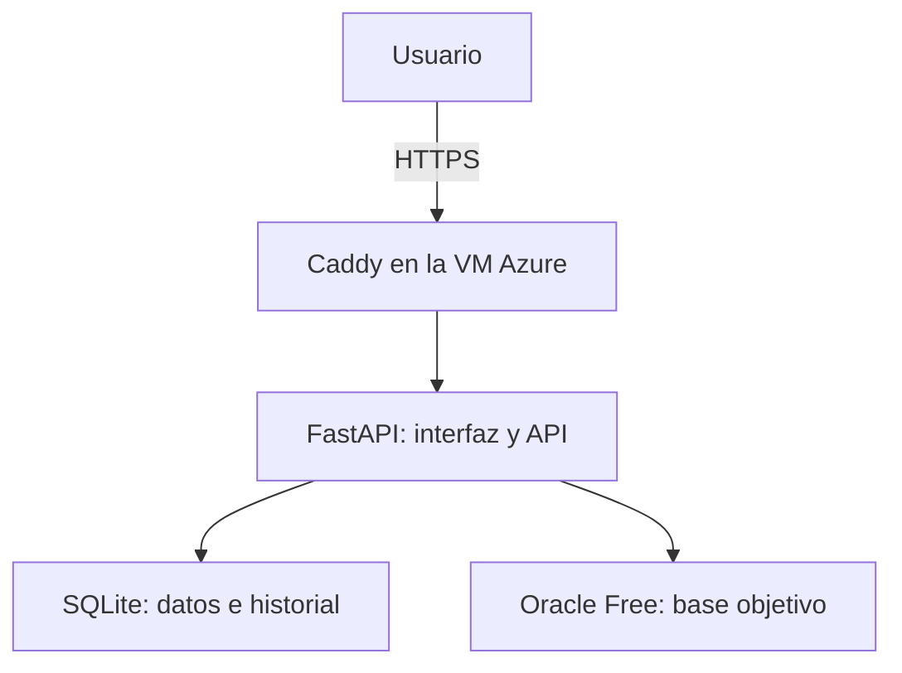

# Framework de pruebas de base de datos SQL

Repositorio académico del proyecto de **Base de Datos 2** de la Universidad Privada de Tacna. Contiene los formatos de entrega y el código de un framework web para definir, ejecutar y registrar pruebas sobre bases de datos SQL. **Oracle Database Free** es el motor objetivo del alcance actual.

## ¿Qué hace el sistema?

El usuario inicia sesión, selecciona un proyecto, configura un perfil de conexión Oracle, crea casos de prueba con una sentencia SQL y una condición esperada, los agrupa opcionalmente en suites y consulta el resultado y el historial de cada ejecución.

| Módulo | Función |
| --- | --- |
| Proyectos | Organizar conexiones, casos y suites por proyecto. |
| Conexiones Oracle | Registrar el perfil y comprobar la conexión; la contraseña se solicita al probar o ejecutar y no se guarda en la base interna. |
| Casos de prueba | Definir SQL y validaciones `ROW_COUNT` o `EXISTS`. |
| Suites | Agrupar y ejecutar casos relacionados. |
| Ejecución | Comparar el resultado esperado con el obtenido y registrar `PASS`, `FAIL` o `ERROR`. |
| Historial | Consultar ejecuciones y sus evidencias. |

Las reglas del motor dependen del ambiente asignado al perfil: `TEST` permite pruebas DML con rollback; `STAGING` exige confirmación para DML y también aplica rollback; `PRODUCTION` admite solo consultas `SELECT`. El motor bloquea DDL y sentencias múltiples. Para conectar una base de producción se debe usar, además, una cuenta Oracle con permisos de solo lectura.

## Organización del repositorio

```text
.
├── README.md                  # Presentación y acceso al proyecto
├── FD01…FD06                 # Formatos y documentos académicos
├── framework-pruebas-sql/    # Aplicación y pruebas
│   ├── app/                  # API, servicios, modelos y motor SQL
│   ├── frontend/             # HTML, CSS y JavaScript
│   ├── alembic/              # Migraciones de la base interna
│   ├── infra/                # Configuración Docker
│   ├── tests/                # Pruebas automatizadas
│   └── docs/                 # Manuales y documentación técnica
└── media/                    # Recursos de los entregables
```

La [guía técnica del sistema](framework-pruebas-sql/README.md) contiene el detalle de instalación local, módulos y pruebas. Los documentos `FD01` a `FD06` corresponden a factibilidad, visión, requisitos, arquitectura, proyecto final y propuesta, respectivamente; cada documento debe revisarse contra la versión del sistema entregada.

## Tecnologías y arquitectura

- **Interfaz:** HTML, CSS, JavaScript y Bootstrap, servidos por FastAPI en `/ui/`.
- **API:** Python, FastAPI y Uvicorn; rutas funcionales bajo `/api/`.
- **Datos internos:** SQLite mediante SQLAlchemy y migraciones Alembic.
- **Motor objetivo:** Oracle Database Free mediante `oracledb`.
- **Validación y pruebas:** `sqlparse` y Pytest.
- **Infraestructura:** máquina virtual Azure con Ubuntu, Docker Compose para la API y Oracle, y Caddy como proxy HTTPS configurado en el servidor.



SQLite conserva los datos propios del framework. Oracle es la base sobre la que se ejecutan las pruebas SQL. Caddy termina la conexión HTTPS y dirige las solicitudes a la API; **no forma parte del `compose.yml` versionado** en `framework-pruebas-sql/infra/production/`.

## Aplicación desplegada

- **URL pública:** <https://frameworksql.sytes.net/ui/>
- **Infraestructura utilizada:** VM de Microsoft Azure, Ubuntu Server, contenedores Docker para FastAPI y Oracle, y Caddy para HTTPS.
- **Servicios definidos en Docker Compose:** `framework_api_prod` (API y frontend) y `framework_oracle_prod` (motor Oracle). La instancia de Caddy se administra por separado en el servidor.

La disponibilidad de la URL depende del estado de la VM, el DNS y los servicios. La validación integral desde otra computadora o red y sus capturas deben quedar registradas como evidencia del equipo; este README no sustituye esa prueba.

### Configuración y operación en el servidor

La configuración de Docker está en [`framework-pruebas-sql/infra/production/`](framework-pruebas-sql/infra/production/). En una VM ya preparada, y **desde ese directorio**, los servicios de aplicación y Oracle se consultan con:

```bash
docker compose --env-file .env.production ps
docker compose --env-file .env.production logs --tail=100 api oracle_db
```

Para reconstruir y levantar esos dos servicios después de una actualización aprobada:

```bash
docker compose --env-file .env.production up -d --build
```

Este comando no instala ni configura Caddy. Los valores reales se conservan en `.env.production` **solo en el servidor**, fuera del control de versiones. Consulte la [guía de producción](framework-pruebas-sql/infra/production/README.md) y verifique los servicios, el proxy y las migraciones antes de operar el despliegue. No publique credenciales, archivos `.env.production`, claves SSH ni la base SQLite.

## Comprobación local del código

Para ejecutar las pruebas automatizadas que no requieren Oracle, desde la raíz de este repositorio:

```bash
cd framework-pruebas-sql
python -m venv venv
```

Active el entorno virtual según su sistema:

```powershell
# Windows PowerShell
.\venv\Scripts\Activate.ps1
```

```bash
# Linux o macOS
source venv/bin/activate
```

Luego instale las dependencias y ejecute las pruebas base:

```bash
python -m pip install -r requirements.txt
python -m pytest -q -m "not oracle_integration"
```

Las pruebas marcadas `oracle_integration` requieren una instancia Oracle y configuración adicional; consulte la [guía del framework](framework-pruebas-sql/README.md). Para usar la aplicación localmente, siga la [instalación local](framework-pruebas-sql/docs/instalacion-local.md). No abra `frontend/index.html` con `file://`: la interfaz se sirve desde FastAPI en `/ui/`.

## Documentación del proyecto

- [README técnico del framework](framework-pruebas-sql/README.md)
- [Arquitectura](framework-pruebas-sql/docs/arquitectura.md)
- [Manual de usuario](framework-pruebas-sql/docs/manual-usuario.md)
- [Manual técnico](framework-pruebas-sql/docs/manual-tecnico.md)
- [Instalación local](framework-pruebas-sql/docs/instalacion-local.md)
- [Despliegue Docker](framework-pruebas-sql/docs/despliegue.md)
- [Configuración de producción](framework-pruebas-sql/infra/production/README.md)

Los documentos académicos de propuesta, factibilidad, visión, SRS y SAD deben describir los módulos y la arquitectura que efectivamente se entregan. Las capturas de acceso público, contenedores, ejecución SQL e historial sirven como evidencia de la sustentación.
